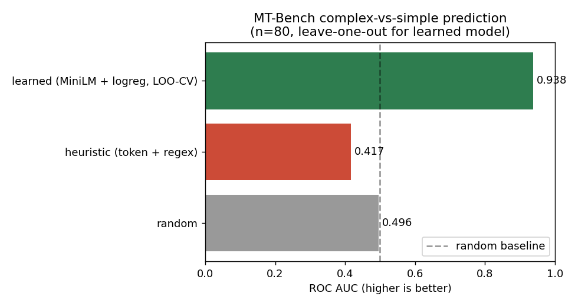
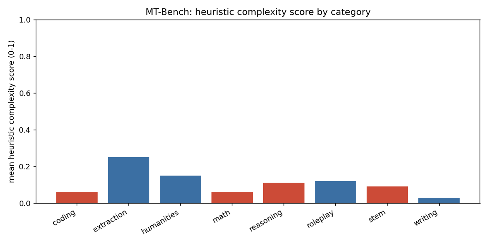

# Findings: heuristic vs learned router on MT-Bench

> Run on 2026-04-20, MacBook CPU. n=80 prompts (one per MT-Bench question).

## Setup

The current router (`src/core/complexity_analyzer.py`) decides whether a
query is "simple" or "complex" using two signals: token count and a
handful of regexes for code blocks and reasoning keywords. The
[RouteLLM paper](https://arxiv.org/abs/2406.18665) makes the case that
this kind of heuristic leaves a lot on the table compared to a learned
router. I wanted to see how much, on a small enough setup that I could
defend every step.

I used the [MT-Bench](https://huggingface.co/datasets/philschmid/mt-bench)
prompts (80 total, 8 categories × 10 prompts) as a proxy for query
difficulty. Four categories — `math`, `reasoning`, `coding`, `stem` —
are the ones where you'd intuitively want a stronger model. The other
four — `writing`, `roleplay`, `extraction`, `humanities` — are where a
small model probably suffices.

The task: predict whether a prompt belongs to a "complex" category from
the prompt text alone. Binary classification, AUC as the metric.

## Methods compared

| Method | What it is |
|---|---|
| `random` | uniform random scores, sanity check |
| `token count only` | length-based baseline |
| `char count only` | even cruder length baseline |
| `heuristic (token + regex)` | the current router heuristic |
| `learned (MiniLM + logreg, LOO-CV)` | [`all-MiniLM-L6-v2`](https://huggingface.co/sentence-transformers/all-MiniLM-L6-v2) embeddings + logistic regression, leave-one-out cross-validation |

## Results

### AUC on the binary task

| Method | AUC |
|---|---|
| token count only | **0.322** |
| char count only | 0.321 |
| heuristic (token + regex) | **0.417** |
| random | 0.496 |
| learned (MiniLM + logreg) | **0.938** |



### Heuristic complexity score by MT-Bench category



Bars in red are categories I'd want to route to a strong model
(`math`, `reasoning`, `coding`, `stem`). Bars in blue are categories
I'd want to route to a small one. The heuristic is clearly not
ordering them the way I expected.

## What I'm taking away

1. **The current heuristic is worse than random** on this task
   (AUC 0.417 vs 0.496). Token count and regex patterns don't just
   fail to capture difficulty — they're actively anti-correlated with
   it. The reason is structural: hard problems often have *short*
   prompts (`"What is the integral of x sin(x)?"`) and easy ones often
   have *long* context (`"Read this paragraph and extract the dates..."`).

2. **A small learned baseline beats it by ~0.5 AUC.** A 22M-parameter
   embedding model + a one-page sklearn pipeline gets to 0.938 on the
   same prompts under leave-one-out CV. That's a meaningful gap, not
   noise.

3. **The "extraction" category has the highest heuristic score**
   (0.250), even though it's the easiest to route to a small model.
   The regex for "explain|analyze|compare" matches extraction prompts
   constantly — they all say "extract...given the following".

4. **`writing` got a heuristic score of 0.030**, the lowest of any
   category, and is correctly the easiest. So the heuristic isn't
   *uniformly* wrong — it just has high variance and the wrong
   discriminating axis.

## Limitations I want to be honest about

- **n=80 is small.** With a class-balanced binary task, that gives
  a noisy AUC estimate. I'd want this on at least 500 prompts before
  publishing a number with confidence intervals.
- **MT-Bench category ≠ true difficulty.** Some "stem" prompts are
  genuinely simple, some "writing" prompts are hard. Using the
  category as a binary label is a proxy, not ground truth.
- **I haven't actually run a model on these prompts to measure the
  *quality* difference between cheap and expensive routing decisions.**
  AUC on a proxy label isn't the same as cost-savings-at-equal-quality.
  That's the next experiment.
- **Leave-one-out CV with logistic regression on n=80 is benign but
  not impervious to optimistic bias.** The test embedding still came
  from the same model that produced the training embeddings.

## What I'd do next

- Replace the heuristic in `src/core/complexity_analyzer.py` with the
  learned classifier (fall back to heuristic only if the embedding
  service is down).
- Run the same experiment on 500-1000 prompts from a more diverse
  distribution (e.g., real production logs from any RAG product,
  or [LMSYS Chatbot Arena conversations](https://huggingface.co/datasets/lmsys/lmsys-chat-1m)).
- Build the **shadow eval**: actually answer each prompt with a small
  model (Llama-3.2-1B-Instruct) and a strong one (Llama-3.1-8B-Instruct
  or an API), measure pairwise quality with a judge model, and report
  cost-savings at fixed quality. That's the number that actually
  matters for production routing.
- Compare the learned classifier against [RouteLLM's released routers](https://github.com/lm-sys/RouteLLM).

## Reproducibility

```bash
python -m venv .venv && source .venv/bin/activate
pip install sentence-transformers scikit-learn matplotlib datasets

python experiments/01_heuristic_vs_mt_bench/run_experiment.py
python experiments/02_learned_baseline/run_experiment.py
```

Random seed: `42`. Both experiments are deterministic on a given
machine; AUC differences across machines should be < 0.001.
